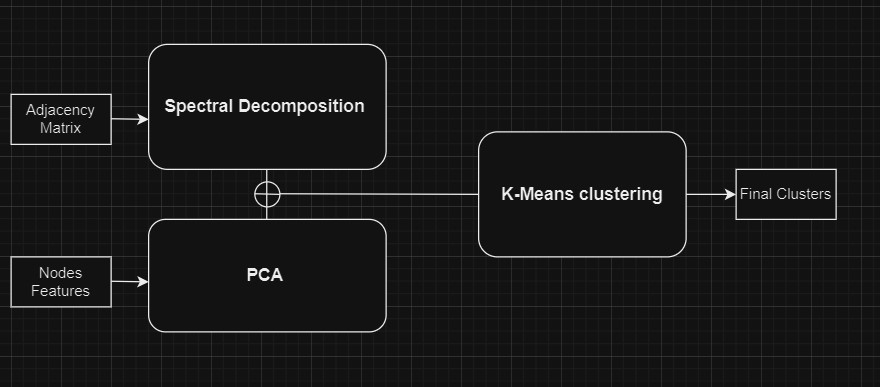
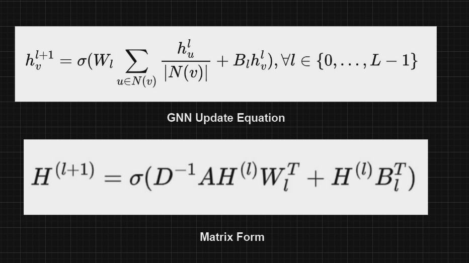

<h1 align = "center">Data Mining Project Report</h1>

<i>Devansh (210150010) and Subhash (210150017)</i>

# Introduction

The project indtroduces us to a kaggle competition where we have to apply Dimensionality Reduction techniques and Graph Networks to cluster and classify the data points given into 10 categories. We have tried multiple approaches like Spectral Clustering and multiple Graph Neural Networks. Now, We will the see the details (pipelines and results) of every approach.

# 1. Our Approach : Spectral Decomposition followed by clustering

* Performed Spectral Clustering on the Adjacency matrix data provided to reduce the dimensionality of the data from to 10. This involved performing eigen decomposition of the Laplacian matrix followed by selection of smallest 10 eigen vectors.

* Then performed PCA which is a linear dimensionality reduction technique, on the nodes features dataset to reduce it's dimensionality.

* Now concatenated the lower dimension data obtained from spectral demposition and PCA to further perform K-Means clustering. Initialization of the K clusters were done to the mean of the nodes provided in the seed.csv file.

* Trained a 2 layer Neural Network for a classification task where the training set was first 10932 nodes concatenated features with their labels obtained from k-means clustering and test set was remaining 1000 nodes of the graph.

  This approach gave us the best results so far, The results were of the adjacency matrix data provided intitially so results might not be replicable for the current adjacency matrix. This is the simplest of the other 2 approaches and gave the best accuracy on the earlier graph as there were less edges as compared to the new one.

# 2. Failed GNNs approaches

## Graph Convolutional Network (GCN) Based

  This was one of the failed approaches that we used which didn't give good accuracy maybe because of the reason that there are only around 11k nodes but some of the nodes even have 6k edges so the networks was not able to learn anything much in less no. of layers and we could not train large networks due to computing power issues.

* Used the matrix form of GCN to produce node embeddings of the graph data. Trained two layers of GCN.

* Used Negative Sampling to calculate the loss function. Lost function we used was the dot product of the embeddings of the nodes with the seeds embeddings.

* Now used the above trained node embeddings to perform K-Means clustering. Initialization of the K clusters were done to the mean of the nodes provided in the seed.csv file.

## GraphSage Network Based
  
This approach also didn't give good result probably due to the same reason as described above.

* Used inbuilt GraphSage network from the stellargraph library of python to produce node embeddings for further clustering 

* Trained the embeddings by producing pairs of nodes obtained by doing random walks of L length, considered L as a hyperparameter and tried various values for L.
  
* Now used the above trained node embeddings to perform K-Means clustering. Initialization of the K clusters were done to the mean of the nodes provided in the seed.csv file.
  

  
