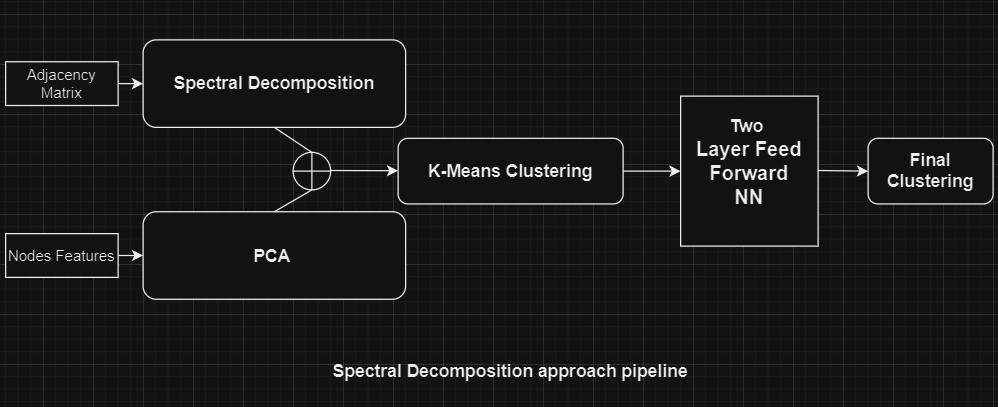

<h1 align = "center">Data Mining Project Report</h1>

<i>Devansh Bhardwaj (210150010) and Subhash Patel (210150017)</i>

# Introduction

The main aim of this project was to assign labels of 10 clusters (from 0 to 9) to 11952 graph nodes, whose adjacency and attributes data were given. For assigning the labels, 3 seed points of each cluster were provided. We have tried multiple approaches like Spectral Clustering and Graph Neural Networks. Now, We will the see the details (pipelines and results) of every approach.

# 1. Our Approach : Spectral Decomposition followed by clustering

  

* For the adjacency data, we performed Spectral Clustering. This involved performing eigen decomposition of the Laplacian matrix followed by selection of smallest 10 eigenvectors.

* For the attributes data, we first standardize the data to have 0 mean and standard devation of 1, and then perform PCA (preserving 0.9 fraction of variance) to reduce the dimensionality of the attributes.

* We then concatenate the normalized attributes and the eigenvectors to get our final embeddings for each node.

* Next we apply K-means clustering of the first 10952 nodes. We initialize the cluster centroids by taking mean of the seed points of each cluster.

* After getting the labels for the first 10952 nodes, we train a 2 layer fully connected Neural Network on those nodes, and get the predictions for the last 1000 nodes.

  This approach gave us the best results of **0.24280** on the **old adjacency** data and 0.14390 on the new adjacency data. The nodes in the new adjacency data have 6000 edges on an average, making it more difficult to deal with, as compared to the old adjacency data which had 50 edges per node on an average.

  Rest of the approaches were tested on the new adjacency data only, they might perform well if trained on the old one.
# 2. Failed GNN approaches

## Graph Convolutional Network (GCN) Based

* We used the matrix form of GCN (2 layers) to produce node embeddings of the graph data using both attributes and adjacency data. Here, the D and A matrix are the adjacency data, and the inital H0 are the attributes (after applying PCA)of the nodes.

    

* For training, we used the seed data provided. We created pairs of seed nodes of each cluster, and tried to maximize their dot product over the sum of dot porducts with other negative samples. For **Negative Sampling**, we used 30 samples for each node. 

* After training the GCN, we extract the final embeddings from model, and perform K-means clustering on the entire data. Again, we initialize the cluster centroids by taking mean embedding of the seed points of each cluster.

  This approach gave a score of **0.11194**, which might be due to the very high number of edges of each node. This leads to the aggregation of messages from all the nodes of the graph as the 2-hop graph of this data is almost fully connected.

  We tried by randomly selecting a small portion of the neighbours for passing the message, but that also didnt improve the score.

## GraphSage Network Based

* We used inbuilt functions from **stellargraph** library of python, to create positive and negative node pairs for training, by doing **random walk** through the graph. Here, positive signify that the nodes are reachable from each other, and negative signifies the opposite.

* We then trained a GraphSAGE embedding encoder attached with a classifier that outputs whether the embeddings (output of the GraphSAGE network) of the given node pair are positive or negative.
  
* The classifier and the GraphSAGE network are trained jointly, and then we extract the embeddings and perform K-means as was done in previous approaches.

  This approach gave a score of 0.10132 which is a very poor score, and the reason is again the highly dense nature of the graph.
  

  

